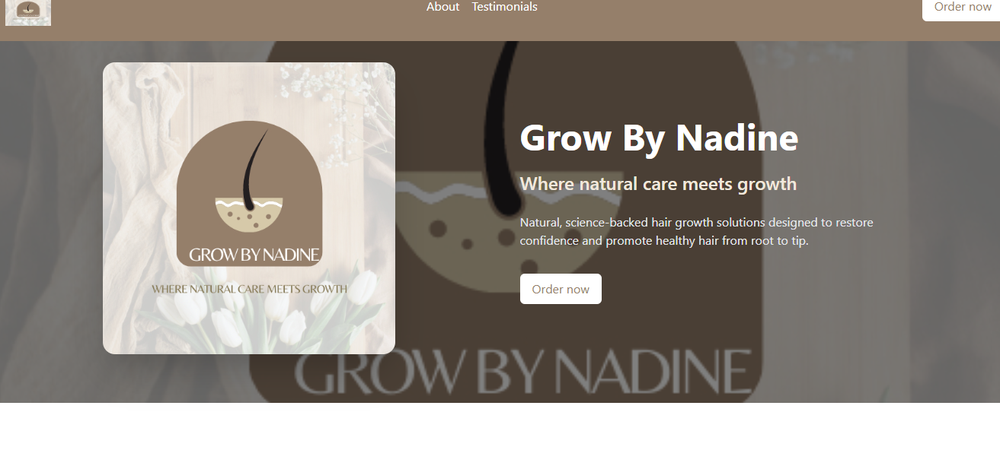
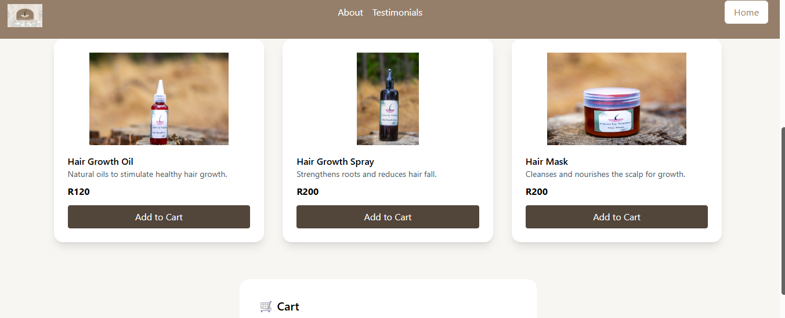
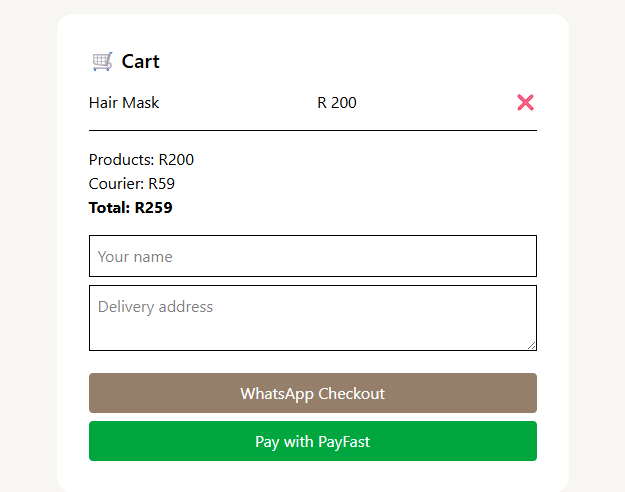
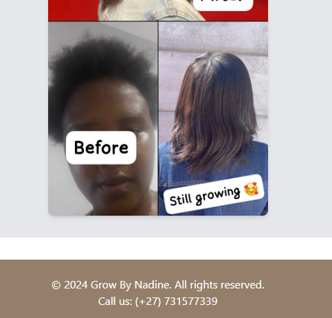
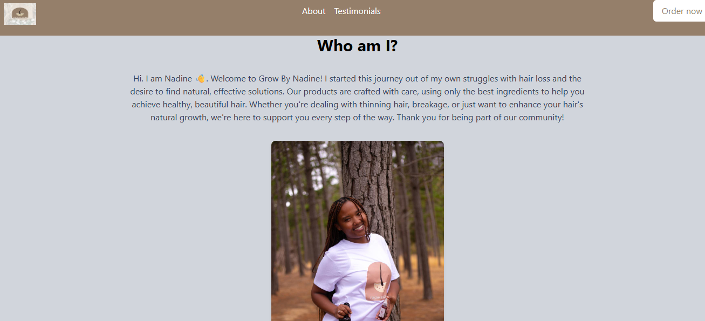
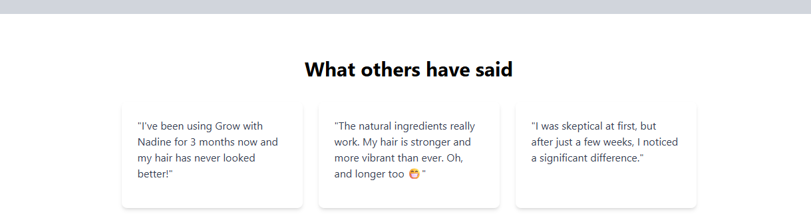

Loom video: https://www.loom.com/share/b19318056a29468e97c55fff36d2cf94
# Grow by Nadine

A modern wellness and e-commerce website built for **Grow by Nadine**, a South African brand focused on natural, science-backed hair growth solutions designed to promote healthy hair and confidence.

## Live Website

🌐 https://www.growbynadine.co.za

## Overview

Grow by Nadine provides customers with access to natural hair care products, educational content, and a streamlined online shopping experience. The website was designed with a strong focus on user experience, mobile responsiveness, and modern visual design.

## Features

* Responsive design for desktop, tablet, and mobile devices
* Product showcase and e-commerce functionality
* Modern and clean user interface
* Optimized navigation and user experience
* Secure hosting and deployment
* Fast-loading pages
* Brand-focused design aligned with wellness and beauty industries

## Technologies Used

* HTML5
* CSS3
* JavaScript ES6
* React
* Responsive Design
* API Integration
* HostAfrica Hosting

## Goals

The objective of this project was to create a professional online presence that:

* Highlights the Grow by Nadine brand
* Improves customer engagement
* Provides an intuitive shopping experience
* Supports business growth through a modern digital platform

## Screenshots

Add screenshots of:

* Home Page
* Product Section
* Mobile View

Example:

```md






```

## Installation

Clone the repository:

```bash
git clone https://github.com/yourusername/grow-by-nadine.git
```

Install dependencies:

```bash
npm install
```

Start the development server:

```bash
npm run dev
```

or

```bash
npm start
```

depending on your setup.

## Deployment

The live website is hosted through HostAfrica because it was the most affordable option for the business at the current time

## Project Status

✅ Live and deployed

## Author

Duwayne Frieslaar

Web Developer

GitHub: https://github.com/yourusername
